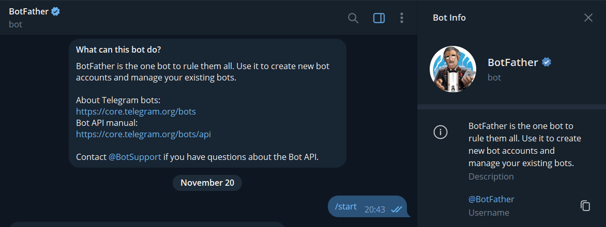
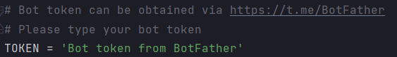
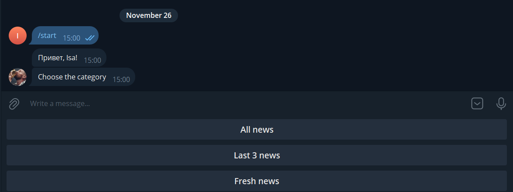
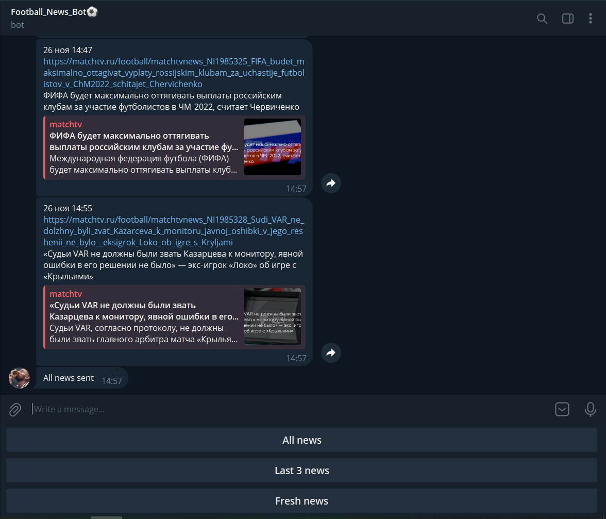

# Telegram bot project
## Установка
При помощи @BotFather получить токен для бота



Склонировать репозиторий.
- В поле TOKEN вставить полученный от токен



Запустить программу при помощи команды
```bash
$> python3 main.py
```

## Работа с программой

- После старта программы появится три кнопки для выбора после нажатия которых будут отправлены новости


